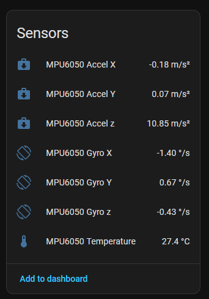

# Accellerometer and Gyroscope
An accellerometer is a sensor to measure movements and pose (using earths gravity as accelleration). The inexpensive GY-521 modules use a MPU6050 chip which provides accellerometer, a gyroscope for measuring rotating movements and a thermometer. This chip is quite cheap and therefore the measured values are not exceptionally precise (but good enough for simple detections).

Here we'll show how to 

* wire up and configure the sensor
* report the accellerometer, gyroscope and temperature values to Home Assistant

ToDo:  

See also:  [Original remote receiver docs](https://esphome.io/components/sensor/mpu6050/)

#### Note 

## Setup


### Connection

Your module has 3 pins. Connect them as follows

* GND to GND
* VIN to 3.3V
* SDA to any capable port. In this example we'll use `GPIO5`
* SCL to any capable GPIO. In this example we'll use `GPIO6`

### ESPHome config
Connect as stated above and then configure like shown here:  

```yaml
i2c:
  sda: GPIO5
  scl: GPIO6
  scan: true
  id: bus_a

sensor:
  - platform: mpu6050
    address: 0x68
    accel_x:
      name: "MPU6050 Accel X"
    accel_y:
      name: "MPU6050 Accel Y"
    accel_z:
      name: "MPU6050 Accel z"
    gyro_x:
      name: "MPU6050 Gyro X"
    gyro_y:
      name: "MPU6050 Gyro Y"
    gyro_z:
      name: "MPU6050 Gyro z"
    temperature:
      name: "MPU6050 Temperature"
    update_interval: 1s        # adjust update rate 
```

Compile and download the firmware to your ESP. After uploading make sure you have your ESP added as a Home Assistant entity.


## HA data display
When your ESP is available in Home Assistant, you should be able to see a different measurements

```log
[13:41:16.150][D][mpu6050:119]: Got accel={x=-0.177 m/s², y=0.117 m/s², z=10.904 m/s²}, gyro={x=-1.463 °/s, y=0.671 °/s, z=-0.488 °/s}, temp=27.071°C
[13:41:16.155][D][sensor:124]: 'MPU6050 Accel X' >> -0.18 m/s²
[13:41:16.161][D][sensor:124]: 'MPU6050 Accel Y' >> 0.12 m/s²
[13:41:16.164][D][sensor:124]: 'MPU6050 Accel z' >> 10.90 m/s²
[13:41:16.168][D][sensor:124]: 'MPU6050 Temperature' >> 27.1 °C
[13:41:16.172][D][sensor:124]: 'MPU6050 Gyro X' >> -1.46 °/s
[13:41:16.184][D][sensor:124]: 'MPU6050 Gyro Y' >> 0.67 °/s
[13:41:16.186][D][sensor:124]: 'MPU6050 Gyro z' >> -0.49 °/s
[13:41:16.356][D][mpu6050:119]: Got accel={x=-0.112 m/s², y=0.048 m/s², z=10.710 m/s²}, gyro={x=-1.585 °/s, y=0.549 °/s, z=-0.549 °/s}, temp=27.071°C
[13:41:16.361][D][sensor:124]: 'MPU6050 Accel X' >> -0.11 m/s²
[13:41:16.365][D][sensor:124]: 'MPU6050 Accel Y' >> 0.05 m/s²
[13:41:16.369][D][sensor:124]: 'MPU6050 Accel z' >> 10.71 m/s²
[13:41:16.374][D][sensor:124]: 'MPU6050 Temperature' >> 27.1 °C
[13:41:16.378][D][sensor:124]: 'MPU6050 Gyro X' >> -1.59 °/s
[13:41:16.387][D][sensor:124]: 'MPU6050 Gyro Y' >> 0.55 °/s
[13:41:16.387][D][sensor:124]: 'MPU6050 Gyro z' >> -0.55 °/s
```

Note that the values measured for `Accel z` are much bigger than for X and Y - a result from earths gravity. Changing the pose by tilting should also be visible in the values. Here the chip was rotated 90° around the Y axis, increasing the X-Acceleration while decreasing Z-Accelleration

```log
[13:48:46.133][D][mpu6050:119]: Got accel={x=-9.724 m/s², y=-0.617 m/s², z=0.907 m/s²}, gyro={x=-0.793 °/s, y=-2.317 °/s, z=0.244 °/s}, temp=27.542°C
[13:48:46.136][D][sensor:124]: 'MPU6050 Accel X' >> -9.72 m/s²
[13:48:46.141][D][sensor:124]: 'MPU6050 Accel Y' >> -0.62 m/s²
[13:48:46.145][D][sensor:124]: 'MPU6050 Accel z' >> 0.91 m/s²
```

Temperature values are way off (room temperature was around 22°C) - it might be that inside the sensor higher temperatures were measured.



Many real world applications just want to react to movements or change of pose. 