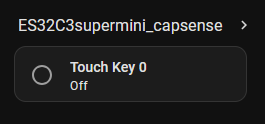

# MPR121 Capacitive Touch sensor module

The MPR121 is a specialised sensor module for capacitive sensing with 12 inputs. Capacitive sensing can be used for binary touch input or even proximity sensing (without touching). While many ESP32s also have touch-sensors built in in some of their GPIOs, the MPR121 is superior when it comes to sensitivity and configurability.

Here we'll show how to 
* wire up and configure the sensor
* make touchable elements (binary)


ToDo:  

See also:  [Original MPR121 ESPHome docs](https://esphome.io/components/binary_sensor/mpr121/)

#### Note about capacitive sensing
TODO

## Setup

The MPR121 sensor module communicates via I2C with the ESP. To make the sensor work it needs to be connected to GND, 3.3V and the SDA and SCL pins of I2C bus. 

### Connection

Your module has 3 pins. Connect them as follows

* GND to GND
* VIN to 3.3V
* SDA to any capable port. In this example we'll use `GPIO5`
* SCL to any capable GPIO. In this example we'll use `GPIO6`

### ESPHome config
Connect as stated above and then configure like shown here:  

```yaml
# i2c bus setup for the MPR121
i2c:
  sda: GPIO5
  scl: GPIO6
  scan: true
  id: bus_a

# basic configuration of the MPR121 component. note that this does not yet deliver any data to HA.
mpr121:
  id: mpr121_component
  address: 0x5A
  touch_debounce: 1     # optional. range is from 0-7
  release_debounce: 1   # optional. range is from 0-7
  touch_threshold: 10   # touch sensitivity. lower values -> more sensitive. should be between 5 and 30.
  release_threshold: 7  # release sensitivity. release threshold should be below touch threshold

# make data available in Home Assistant. here a binary sensor for channel 0 is configured.
binary_sensor:
  - platform: mpr121
    id: touch_key0
    channel: 0
    name: "Touch Key 0"
    touch_threshold: 12
    release_threshold: 6
```

After configuring the `mpr121` component we need to make the data available to Home Assistant by configuring a `binary_sensor`, which uses the `mpr121` as a platform. The 12 available inputs on the module can be references using the `channel` parameter. Individual threshold settings can be applied for each channel.

Before powering on your setup, connect a cable to the input of the MPR121 and leave the other end open. Then, compile and download the firmware to your ESP. After uploading make sure you have your ESP added as a Home Assistant entity.


## HA data display
In a first test, open the Log window in the ESP home device builder for your ESP. By touching your cable (connected to the channel input) you should see output like this:

```log
[13:08:47.471][D][binary_sensor:048]: 'Touch Key 0' >> ON
[13:08:47.569][D][binary_sensor:048]: 'Touch Key 0' >> OFF
[13:08:47.641][D][binary_sensor:048]: 'Touch Key 0' >> ON
[13:08:47.755][D][binary_sensor:048]: 'Touch Key 0' >> OFF
```

In Home Assistant, you should have a binary sensor that toggles on/off when touching the cable. Note: you don't necessarily have to touch the tip of the cable, just touching the insulation around the conductor might be enough.




## Using touch in real-world applications

While touching a cable is good enough for testing, in real world applications the touchable surfaces are most likely included in objects or surfaces. To achieve this, only an electric connection from any conducting element (mostly metals) to the pin is necessary. Adjustments for the sensitivity are necessary depending on the size of the conductor and the distance of your finger to the conductor (which happens when you hide the conducting element behind a surface).

A good way to integrate touch in your applications would be to use copper tape as it is thin and can be put below other insulators (like under a 3D printed surface or integrated into furniture).