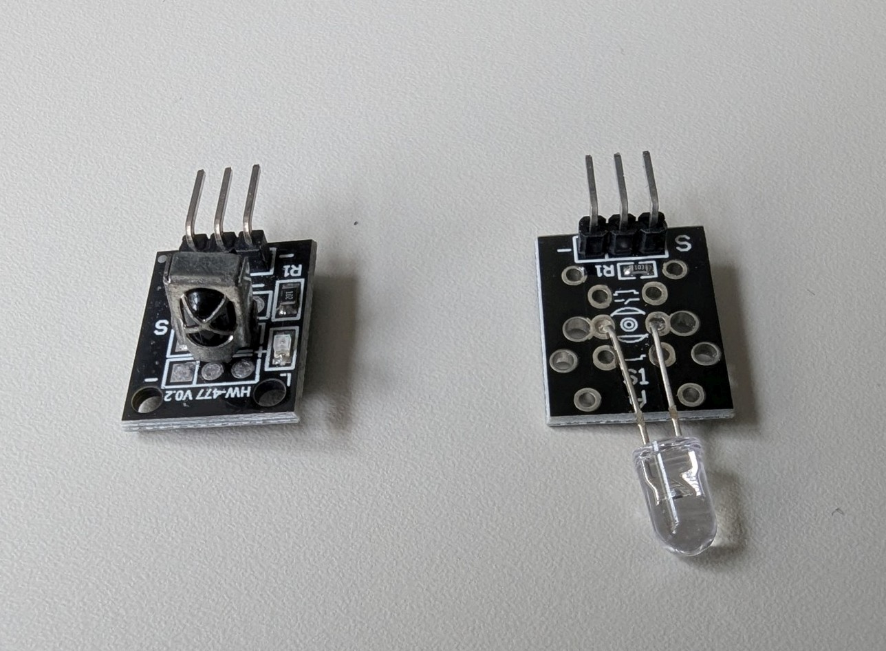
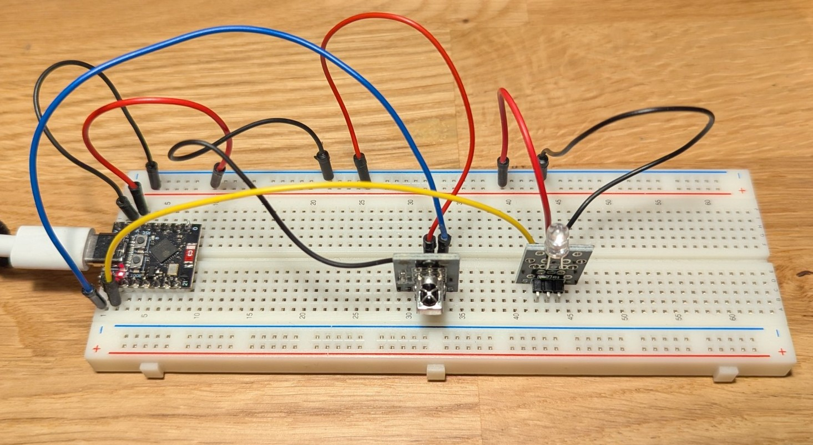
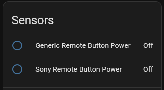

# IR Remote Receiver and Transmitter

IR remote control can be used to control regular devices that come with an IR remote control (like TVs, air conditions, etc.) directly from home assistant. 

 

Here we'll show how to 
* receive IR commands from an existing remote (e.g. for analysing the commands used) using an IR receiver module (KY-22)
* let Home Assistant your devices that usually would be controlled via a IR remote using an IR LED module.


See also:  [Original remote receiver docs](https://esphome.io/components/remote_receiver/)


## Get to know your remote

Different vendors use various command protocols for IR remotes. Luckily, most of them are known and can be decoded easily. We can listen for them to control something in HA using the remote or later replicate them and send our own commands. Using an IR receiver module known as *KY-22* we can receive the IR pulses from most regular remote controls.

### Setup

Your module has 3 pins. Connect them as follows
* **-** for GND
* (middle pin) for connection with 3.3V
* **S** for connection with the GPIO of the board. In this example we'll use `GPIO5`



### ESPHome config
Connect as stated above and then configure like shown here:  

```yaml
remote_receiver:
  pin: 
    number: GPIO5
    # our IR module outputs active LOW, the signal therefore has to be inverted
    inverted: True
  dump: all
```

Compile and download the firmware to your ESP.

### Inspecting the IR output

When pressing any button on your IR remote control close to the sensor, you should see a red LED flashing on the module (indicating it received something). 
Now look at the LOGs output in ESPHome Dashboard to see what we actually received.


```log
[21:28:09.763][I][remote.pronto:240]: 0000 006D 000D 0000 005B 001A 002B 001A 0014 001A 002B 001A 0014 001A 002B 001A 0014 001A 0016 0018 002D 0018 0014 001A 0014 001A 0014 001A 0014 0181 
[21:28:09.767][I][remote.sony:065]: Received Sony: data=0x00000A90, nbits=12
```
The first line has the raw IR codes (which we could use but are cumbersome). More convenient is the lower line, which shows the decoded Sony command when the power button is pressed. 

## Use the code to trigger a home assistant automation

Let's now only listen to the SONY protocol and create a binary sensor entity for HA to trigger automations with the IR remote.

```yaml
remote_receiver:
  pin: 
    number: GPIO5
    # sony remote needed this
    inverted: True
  dump: sony

binary_sensor:
  - platform: remote_receiver
    name: "Remote Button Power"       # → binary_sensor.ir_receiver_remote_button_1
    id: btn_1
    filters:
      - delayed_off: 200ms        # Stay ON for 200ms after signal
    sony:
      nbits: 12 
      data: 0xA90
```

Log output now looks like this
```log
[22:05:19.569][D][binary_sensor:048]: 'Remote Button Power' >> ON
[22:05:19.572][I][remote.sony:065]: Received Sony: data=0x00000A90, nbits=12
[22:05:19.624][I][remote.sony:065]: Received Sony: data=0x00000A90, nbits=12
[22:05:19.828][D][binary_sensor:048]: 'Remote Button Power' >> OFF
```

In Home Assistant we now have a button that is triggered when we send a remote control command.


#### Note
Different IR remotes might have different expected formats. Here is another example of this generic remote (with `dump: all`):

```log
[22:11:28.627][I][remote.jvc:049]: Received JVC: data=0x00FF
[22:11:28.629][I][remote.lg:054]: Received LG: data=0x00FF02FD, nbits=32
[22:11:28.635][I][remote.nec:097]: Received NEC: address=0xFF00, command=0xBF40 command_repeats=1
[22:11:28.640][I][remote.pioneer:149]: Received Pioneer: rc_code_X=0x0040
[22:11:28.642][I][remote.pronto:232]: Received Pronto: data=
[22:11:28.642][I][remote.pronto:240]: 0000 006D 0022 0000 0155 00AF 0012 0019 0012 0018 0015 0016 0012 0018 0014 0017 0013 0018 0012 0019 0013 0017 0013 0042 0014 0042 0012 0043 0013 0042 0014 0042 0012 0043 0013 0042 0014 0042 0012 0018 0014 0017 0014 0017 0012 0018 
[22:11:28.648][I][remote.pronto:240]: 0014 0017 0013 0018 0012 0043 0014 0017 0012 0043 0014 0041 0015 0041 0012 0043 0014 0041 0015 0041 0012 0019 0014 0041 0012 0181 
```

It sends multiple command formats at once. Let's configure it to additionally listen for the NEC command:

```yaml
remote_receiver:
  pin: 
    number: GPIO5
    # sony remote needed this
    inverted: True
  dump: all

binary_sensor:

  - platform: remote_receiver
    name: "Sony Remote Button Power"       # → binary_sensor.ir_receiver_remote_button_1
    id: btn_1
    filters:
      - delayed_off: 200ms        # Stay ON for 200ms after signal
    sony:
      nbits: 12 
      data: 0xA90

  - platform: remote_receiver
    name: "Generic Remote Button Power"
    id: btn_2
    filters:
      - delayed_off: 200ms        # Stay ON for 200ms after signal
    nec:
      address: 0xFF00
      command: 0xBF40
```

As you can see, NEC requires a different configuration to Sony.

Here it how it looks like on the Home Assistant side:



ToDo: 

##  Adding an IR Sender
For IR control of devices using Home Assistant (e.g. for turning on a TV from HA) we need an IR transmitting diode module.

See also: [Original IR Transmitter docs](https://esphome.io/components/remote_transmitter/)


### Setup

Your module has 3 pins. Connect them as follows
* **-** for GND
* (middle pin) for connection with 3.3V
* **S** for connection with the GPIO of the board. In this example we'll use `GPIO6`

(also see foto on top of this page)

### Sending IR codes from Home Assistant

Add the following configuration

```yaml
remote_transmitter:
  pin: GPIO6
  carrier_duty_percent: 50%

button:
  - platform: template
    name: "Sony Power"
    on_press:
      - repeat:         # note: some devices need the command to be sent multiple times
          count: 8
          then: 
          - remote_transmitter.transmit_sony:   # send a sony IR command
              data: 0xA90
              nbits: 12
          - delay: 40ms   # delay between repetitions
```

This will setup the IR diode for transmission. The `button` entity will create a pressable button in Home Assistant, which will send the specified IR command. Sometimes it is necessary to send it multiple times for the devices to pick up the command. The `on_press` automation therefore has a `repeat` statement which repeats sending the code `count` times.

#### Note:
Depending on the IR-diode power supply the sent IR code might not be as strong as a handheld remote. Try moving closer to the receiving device if the command is not picked up. Another option would be to use the 5V power supply on the IR diode for a stronger illumination.


## Note regarding parallel use of IR and adressable LEDs

To generate the signals for the IR remote, most ESP32 chip have an internal hardware RMT (=remote) module. It can generate coded waveforms signals without putting too much pressure on the CPU. However, if multiple instances want to use this module you might run into a conflict. An example would be the use of addressable leds using the [ESP32 RMT Adressable LED Strip](https://esphome.io/components/light/esp32_rmt_led_strip/) that also uses the RMT to generate the codes for the LEDs. 

**In short: You cannot use the IR transmitter and the LED strips at the same time!**