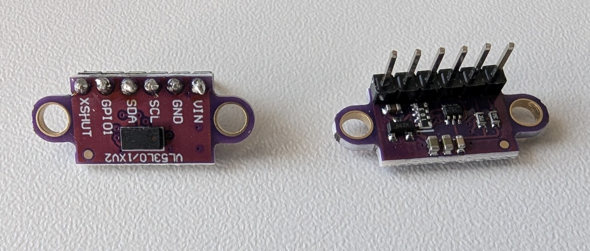
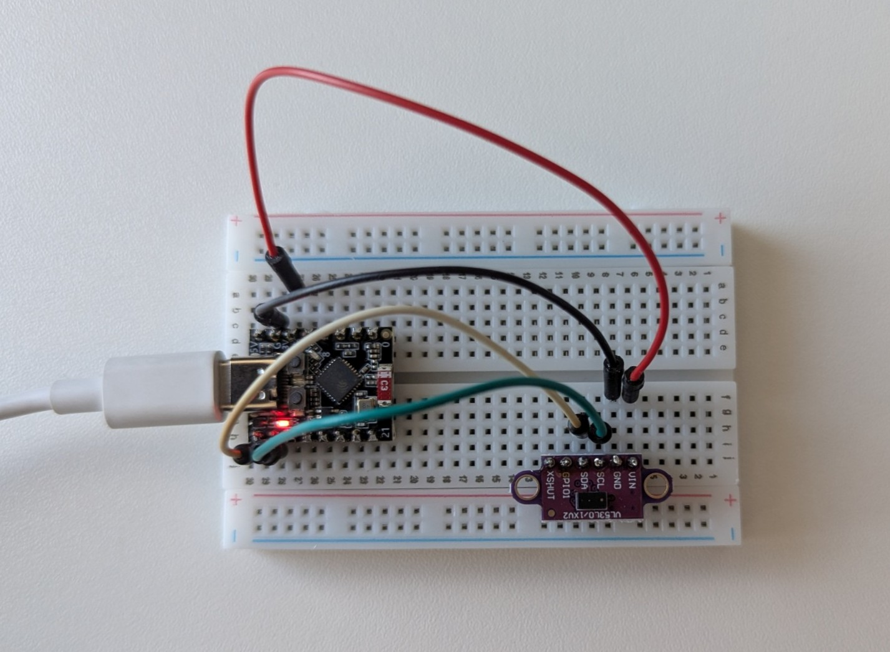
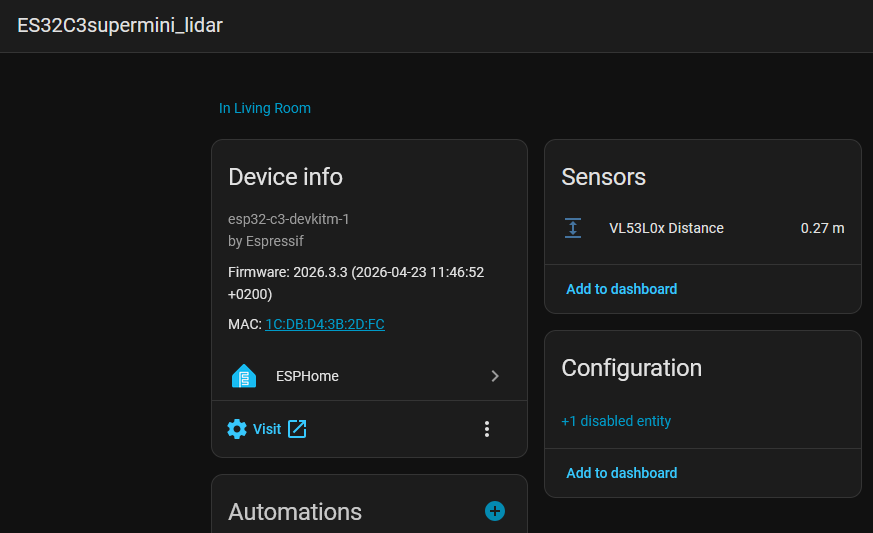

# Lidar Distance Sensor
Lidar distance sensors use light pulses to derive the distance of objects. 

Here we'll show how to 
* wire up and configure the sensor
* report the distance of objects to Home Assistant

 

See also:  [Original remote receiver docs](https://esphome.io/components/sensor/vl53l0x/)

#### Note about distance
The quality of the distance measurements is limited by the reflectivity of the measured surface. Depending this measuements are possible from a few centimeters up to 2 meters. From experience, reliable results are possible within 80cm but be sure to test it for your application.

## Setup

The vl53l0x sensor module communicates via I2C with the ESP. To make the sensor work it needs to be connected to GND, 3.3V and the SDA and SCL pins of I2C. 

### Connection

Your module has 3 pins. Connect them as follows

* GND to GND
* VIN to 3.3V
* SDA to any capable port. In this example we'll use `GPIO5`
* SCL to any capable GPIO. In this example we'll use `GPIO6`



### ESPHome config
Connect as stated above and then configure like shown here:  

```yaml
# i2c setup is needed for the vl53l0x sensor
i2c:
  sda: GPIO5
  scl: GPIO6
  #scan: true
  id: bus_a

# sensor configuration
sensor:
  - platform: vl53l0x
    name: "VL53L0x Distance"
    address: 0x29           # each i2c sensor has a unique, predefined address
    update_interval: 200ms  # how quickly we want our updates
    #long_range: true
```

Compile and download the firmware to your ESP. After uploading make sure you have your ESP added as a Home Assistant entity.

Please check the documentation for additional configuration options.

## HA data display
When your ESP is available in Home Assistant, you should be able to see a distance measurement.

