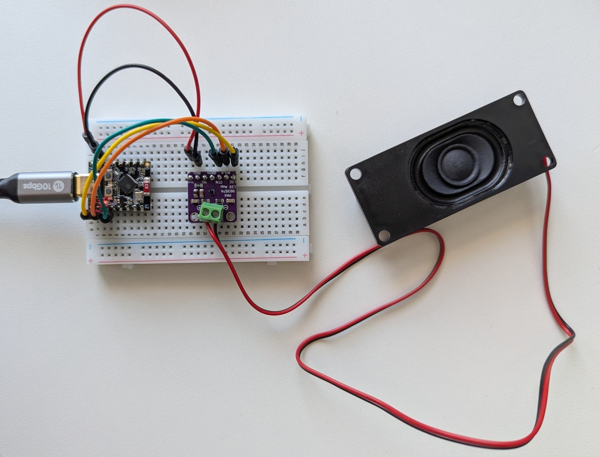
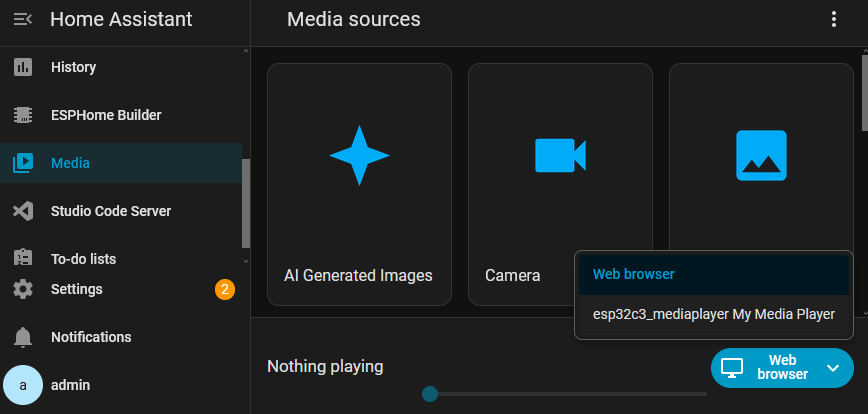
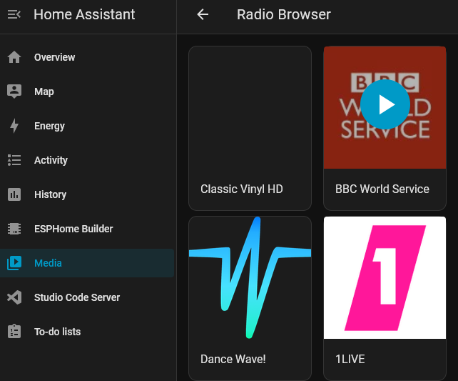
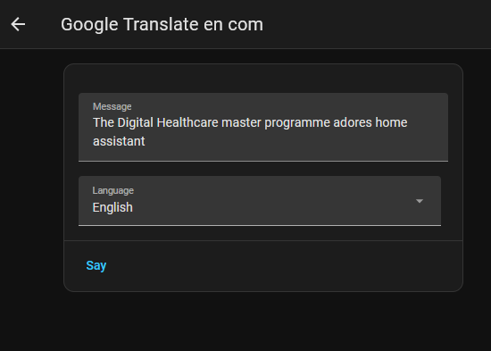

# Media Player using I2S Audio

A neat feature of the HA and ESPHome environment is audio playback directly from the chip. The media player framework allows for playing back from different sources like web-radios or even short audio snippets stored on the ESP directly (not demoed here).

Here we'll use an I2S audio amplifier (based on the MAX98357A chip) to drive a little speaker and playback a webstream. *I2S* is a serial protocol for audio streams among chips. The ESP32 generates this audio stream and using I2S it is transmitted to the amplifier, where it is made audible.



See also 
* [Original I2S audio speaker component docs](https://esphome.io/components/speaker/i2s_audio/).
* [Original speaker component docs](https://esphome.io/components/speaker/)
* [Original media player component docs](https://esphome.io/components/media_player/)


### Note regarding processing power

The ESP32-C3 chip is rather limited in memory and processing ressources and probably cannot use all features of the media player framework reliably (like audio mixing). For more processing power, switch e.g. to an ESP32-S3 chip. This tutorial will therefore cover a very basic use case.


## Setup
Apart from the power connection, we need to setup I2S, which requires 3 lines: `LRCLK`, `BCLK` and `DATA`

* `VIN` to 5V
* GND to GND
* I2S
  * `LRCLK` to `GPIO5`
  * `BRCLK` to `GPIO6`
  * `DIN` to `GPIO7`

## Configuration

The `media_player` component requires the `speaker` component, which itself requires the `i2s_audio` component to be setup.

```yaml
i2s_audio:
  i2s_lrclk_pin: GPIO5
  i2s_bclk_pin: GPIO6

speaker:
  - platform: i2s_audio
    id: my_speaker
    dac_type: external
    i2s_dout_pin: GPIO7
    channel: left         # MAX98357A has mono output. we will use the left channel
    num_channels: 1
    sample_rate: 16000
    buffer_duration: 100ms   # add this; default is 500ms, reduce to save RAM on the C3

media_player:
  - platform: speaker
    name: "My Media Player"
    id: my_media_player
    announcement_pipeline:
      speaker: my_speaker
      format: FLAC
      num_channels: 1
      sample_rate: 16000
    buffer_size: 32768    # reduced from default 1MB to fit C3's limited RAM
    volume_initial: 0.5
    volume_min: 0.0
    volume_max: 1.0
```

After setting this up and uploading, we can use Home Assistants media player to route audio to the ESPs media player.



Choose your esp from the playback targets. Then, select any webradio channel from the radio browser above.

### Playing back a webstream



After hitting play, playback should start on your speaker. 

Note: The stream is not directly routed to the ESP from online, but rather received on the Raspberry Pi running Home Assistant, transcoded to the FLAC format (as configured above with `format: FLAC`) and then streamed to the ESP. 

### Making an TTS-announcement
Navigate back to your media sources and choose the Text-to-speech category.


By default, you will find * Google Translate* as a TTS generator there. Open it, write some text and hit the *Say* button. Your music playback should stop and the written announcement is played back as spoken language over your speaker.



### A note about the media player channels
The media player actually provides two pipelines: the `media_pipeline` and the `announcement_pipeline`. Due to processing constraints of the C3 chip, we can only use one pipeline at a time. The example above therefore uses the  `announcement_pipeline` both for media playback AND announcements. Therefore, an announcement interrupts media playback.