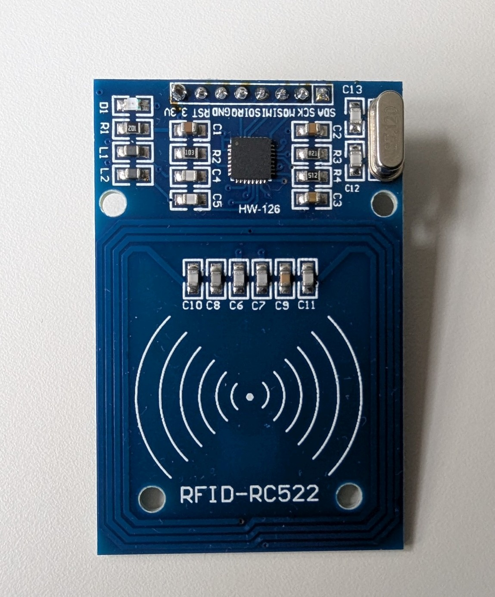
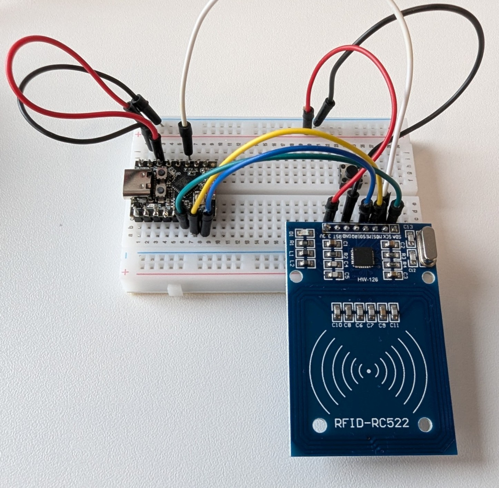

# RFID-Reader RC522

## Usage
RFID tags can be used in different ways with Home Assistant and ESPHome. Tag handling using ESPhome is conceptually simple as we only detect that someone scanned a tag, which can raise an event within Home Assistant. The other usecase would be to setup tags to be scanned with a smartphone and the HA companion app, which has the additional property that we know *who* scanned the tag with *which device (phone)*. 



This tutorial explores the simple usecase of a RFID reader scanning tags.

See also: [Original RC522 component docs](https://esphome.io/components/binary_sensor/rc522/)

## Setup
The RC522 module uses the SPI bus communicating with the ESP. 

* 3.3V to 3.3V
* GND to GND
* `SCK` to `GPIO2`
* `SDA` (CS) to `GPIO10`
* `MISO` to `GPIO21`
* `MOSI` to `GPIO20` 



## Configuration

Configuration requires first to setup the SPI bus and then the `rc522_spi` component.

```yaml
spi:      # define SPI bus for RC522
  clk_pin: 2
  miso_pin: 21
  mosi_pin: 20

rc522_spi: # configure RC522 to use SPI (hardware default)
  cs_pin: 10
  update_interval: 0.1s
```


In a simple scenario one can listen for a certain ID and see if it is available or not to output as a binary sensor.

```yaml
binary_sensor:
  - platform: rc522
    uid: 0a-a2-ca-80      # check for a specific tag (optional)
    name: "RC522 RFID Tag"
```

A more generic way would be to use automations to output the RFID tag ID as a `text_sensor`, which could be further processed in Home Assistant.

```yaml
  on_tag:     # when a tag is detected
    then: 
      - text_sensor.template.publish: # write tag ID to a text sensor
          id: rfid_tag
          state: !lambda 'return x;'
  
  on_tag_removed:
    then:
      - text_sensor.template.publish: # clear text sensor when tag is removed
          id: rfid_tag
          state: ""
    


text_sensor:
  - platform: template
    name: "RFID Tag ID"
    id: rfid_tag
```

## Using Home Assistant Tags

Home Assistant knows the general concept of tags. To make the RFID scanner raise a Home Assistant event that a tag was scanned, use the following ESPHome automation:

```yaml
  on_tag:     # when a tag is detected
    then: 
      - homeassistant.event:
          event: esphome.tag_scanned
          data:
            tag_id: !lambda |-    # return the tag-id using a lambda expression
              return x;
```

In Home Assistants Tag category, the scanned tag should show up and can further be processed e.g. for calling Home Assistant automations.