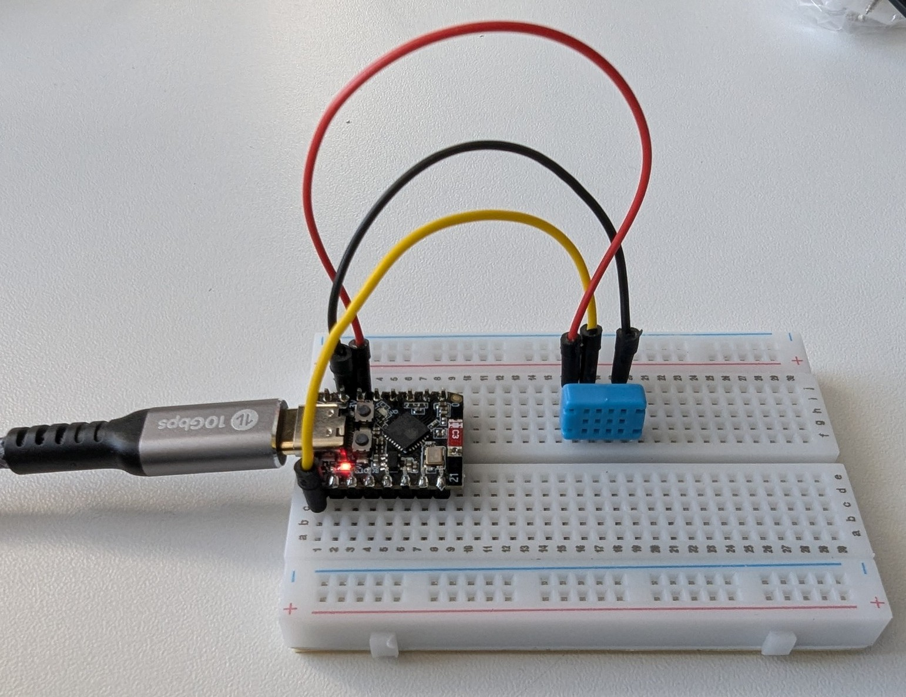
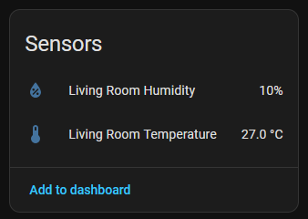

# DHTxx Type Temperature and Humidity sensor

Measuring air temperature and humidity is a key factor for well being in living and working environments. The DHT type sensor range (DHT11, DHT12, DHT22, ...) output temperature and humidity readings and can be used within ESPhome. 



See also [DHT component documentation](https://esphome.io/components/sensor/dht/)

## Setup
The provided sensor is of type DHT12 which can be used via *OneWire* or *I2C* protocols. For the use in ESPHome, only *OneWire* appears to be possible and the `model` configuration will be set to `DHT11`.

Connect the pins as follows:

* Leftmost (first) pin connects to 3.3V
* second pin connects to `GPIO5`
* third pin is not connected
* fourth pin connects to GND


### Note regarding pullup resistors
The signal pin (`GPIO5`) requires a pullup-resistor. The provided sensor module does not provide one but other popular modules do. Be sure to adjust the `pullup` configuration accordingly (see below).

## Configuration

```yaml
sensor:
  - platform: dht
    pin: 
      number: GPIO5
      mode: 
        input: true
        pullup: true  # true for our DHT12 sensor module
    temperature:
      name: "Living Room Temperature"
    humidity:
      name: "Living Room Humidity"
    update_interval: 5s
    model: DHT11    # note: we are using a DHT12 sensor but it can be addressed like a DHT11
```

## Values in Home Assistant
Once the board is added to Home Assistant, you can see the measured values in the interface.

